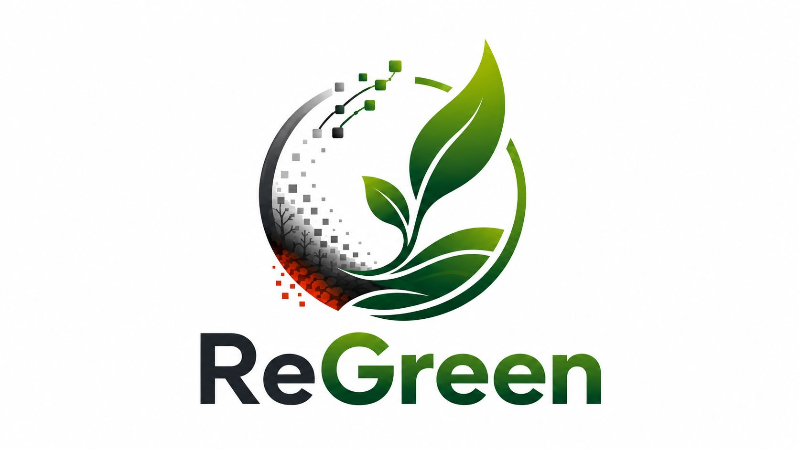
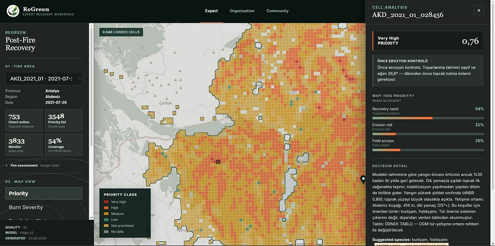
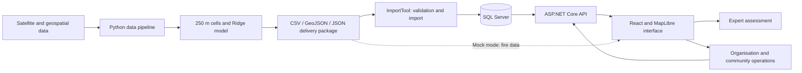

<p align="center">
  
</p>

# ReGreen

**A decision support platform for post-fire recovery analysis and intervention prioritization.**

ReGreen is being developed for the Huawei ICT Competition – Innovation Track. It combines satellite data and machine learning to estimate vegetation recovery gaps after wildfires, helping experts decide where to direct limited teams and resources. Organisation and community workspaces connect these assessments with field activities, volunteer participation, and observations.

[Quick start](#quick-start) · [Full setup](#full-setup) · [Model and data](#model-and-data) · [Documentation](#documentation)

## Expert Workspace



*Intervention priorities are color-coded on the map. The right panel shows the selected cell's priority score, contributing factors, and field recommendation. The screenshot includes Turkish recommendation text from the current application.*

## Features

| Workspace | Route | Capabilities |
| --- | --- | --- |
| Expert | `/` | Explore fire areas and 250 m cells, inspect cell details, and adjust priority weights |
| Organisation | `/organisation` | Assess recovery zones, plan field activities, and review observations |
| Community | `/community` | Discover activities, join as a volunteer, and submit field observations |

The Expert Workspace can use the bundled data package in **mock mode** or connect to the live API. Activity, volunteer, and observation operations **always use the live API**; these flows have no mock implementation.

## How it works



1. Satellite and geospatial layers are aligned to a shared 250 × 250 m grid.
2. The model estimates the vegetation gap expected to remain two years after a fire.
3. Recovery gap, slope, and road access are combined into an intervention priority score.
4. A rule-based **recommendation layer** produces explainable guidance, such as monitoring, field inspection, or erosion control first.
5. Experts assess areas on the map; organisations manage field activities, and volunteers manage participation and observations.

Changing priority weights changes the ranking, but not the cell's recommendation. Recommendation text is generated from rules; no language model runs at application runtime.

## Technology stack

| Layer | Technologies |
| --- | --- |
| Interface and mapping | React 19, TypeScript, Vite 7, MapLibre GL |
| API and data access | ASP.NET Core / .NET 9, Entity Framework Core |
| Database | SQL Server; LocalDB for Windows development |
| Machine learning and geospatial processing | Python, scikit-learn, pandas, rasterio, Shapely |
| Validation | Vitest, .NET test projects, Python unittest, GitHub Actions |

## Quick start

**You do not need to train a model or set up a database to explore the Expert Workspace.** The mock service reads the data package included in this repository.

Requirements: Node.js 24 and npm, matching the frontend CI environment. Run the following commands from the repository root in PowerShell:

```powershell
cd frontend
npm ci
if (-not (Test-Path .env.local)) { Copy-Item .env.example .env.local }
```

Check the values in `frontend/.env.local`:

```dotenv
VITE_SERVICE_MODE=mock
VITE_API_BASE_URL=http://localhost:5066
```

```powershell
npm run dev
```

Open [http://localhost:5173](http://localhost:5173). If Vite selects another port, use the address printed in the terminal. The basemap may require an internet connection. Complete the full setup below to use organisation and community record operations.

## Full setup

Requirements: Node.js 24, **.NET 9 SDK**, and **SQL Server LocalDB**. The default database setup targets Windows. To use SQL Server instead of LocalDB, set the `REGREEN_CONNECTION_STRING` environment variable to the same database in each terminal running migrations, imports, or the API.

### 1. Create the database and import sample data

From the repository root:

```powershell
dotnet tool restore
dotnet build backend/ReGreen.sln --configuration Release
dotnet ef database update --project backend/ReGreen.Data
dotnet run --project backend/ImportTool -- sample-data/backend-data/manifest.json
```

The default connection uses the `ReGreen` database on `(localdb)\MSSQLLocalDB`. **Sample data files are included in the repository; the local database must be created separately on each machine.** Migrations do not run automatically when the API starts.

To validate the package without writing to the database:

```powershell
dotnet run --project backend/ImportTool -- sample-data/backend-data/manifest.json --dry-run
```

### 2. Start the API

```powershell
dotnet run --project backend/ReGreen.Api --launch-profile http
```

The API runs at [http://localhost:5066](http://localhost:5066). Its [OpenAPI document](http://localhost:5066/openapi/v1.json), available in the development environment, lists the implemented endpoints. Check the [fire list](http://localhost:5066/api/fires) to verify the import and the [readiness endpoint](http://localhost:5066/health/ready) to verify database connectivity.

### 3. Connect the frontend

Update `frontend/.env.local`:

```dotenv
VITE_SERVICE_MODE=http
VITE_API_BASE_URL=http://localhost:5066
```

In a separate terminal, starting from the repository root:

```powershell
cd frontend
npm ci
npm run dev
```

Restart Vite after changing environment variables. The API's development CORS settings allow `localhost` and `127.0.0.1` on ports 5173 and 3000. If you use another port, update the [CORS configuration](backend/ReGreen.Api/appsettings.Development.json).

## Model and data

The bundled [`ridge_v2` delivery package](sample-data/backend-data/manifest.json) contains **53 fires and 37,163 cells**. The model was evaluated using 16,074 labeled cells across 27 spatial groups. Nearby fires are kept in the same group, and each test group is excluded from training during evaluation.

| Metric | Result recorded in the delivery package |
| --- | --- |
| Mean within-fire Spearman correlation | 0.686 |
| Top-20% hit rate | 52.8% |
| Top-20% hit rate, dNBR baseline | 38.8% |
| Pairwise accuracy | 75.8% |

These results are **out-of-fold estimates using LeaveOneGroupOut**, not field-validated operational success rates. Methods, experiments, and limitations are described in the [AI documentation](ai/README.md) and [model log](ai/MODEL_GUNLUGU.md).

Data sources include Sentinel-2, MODIS, Copernicus DEM, ESA WorldCover, Impact Observatory, and OpenStreetMap. Raw satellite data and large intermediate files are not included in the repository. To rerun the pipeline or training, follow the [AI setup instructions](ai/README.md#kurulum); the pipeline has been verified with Python 3.10.11.

### Priority score

Default weights:

```text
priority = 0.50 × n(recovery gap)
         + 0.30 × n(slope)
         + 0.20 × (1 − n(distance to road))
```

Here, `n` is within-fire min–max normalization over cells with model predictions. Experts can adjust the weights to compare intervention scenarios. Missing data and cells outside the model's eligibility criteria appear as separate states in the interface.

## Repository structure

```text
ReGreen/
├── ai/             # Data pipeline, model training, experiments, and delivery generation
├── backend/        # .NET API, data model, ImportTool, and tests
├── frontend/       # Expert, organisation, and community workspaces
├── docs/           # API, data, recommendation, and integration contracts
└── sample-data/    # Prepared data packages and examples
```

## Testing and validation

Run frontend checks from `frontend/`:

```powershell
npm run typecheck
npm test
npm run build
```

Run backend and AI safety tests from the repository root:

```powershell
dotnet test backend/ReGreen.sln --configuration Release
python -m unittest discover -s ai/tests -v
```

To include LocalDB integration tests on Windows with LocalDB installed:

```powershell
$env:REGREEN_RUN_LOCALDB_TESTS = '1'
dotnet test backend/ReGreen.sln --configuration Release
```

GitHub Actions workflows cover [frontend checks](.github/workflows/frontend-ci.yml), [backend checks](.github/workflows/backend-ci.yml), and [AI safety checks](.github/workflows/ai-safety-ci.yml).

## Current limitations

- The system is under development and supports expert judgment. The sample habitat table used for species recommendations has not yet been approved.
- The API does not yet implement authentication or role-based authorization. Organisation and volunteer registration flows do not replace identity verification.
- Fire data can be explored in mock mode; activity, volunteer, and observation operations require a running API and database.

## Documentation

Most detailed module documents are currently in Turkish.

| Document | Contents |
| --- | --- |
| [AI](ai/README.md) | Data sources, training, evaluation, and delivery generation |
| [Backend](backend/README.md) | Import tooling and backend operation details |
| [Frontend](frontend/README.md) | Interface structure and data states |
| [Data contract](docs/data-contract.md) | Shared field names, types, and meanings |
| [API contract](docs/api-contract.md) | HTTP contracts for fire and recommendation endpoints |
| [Recommendation contract](docs/hukum_sozlesmesi.md) | Recommendation codes, rules, and integration |
| [Import flow](docs/import-flow.md) | Data validation and import process |
| [Sample data](sample-data/README.md) | Backend and frontend data packages |

Some status notes in module documents describe earlier development stages. Use this README for the current setup and service-mode behavior, and the running API's OpenAPI document for the current endpoint list.

## Team and contributing

| Team member | Responsibility |
| --- | --- |
| Buğra | Artificial intelligence |
| Beytullah | Backend and cloud |
| Zeynep | Frontend, GIS, and user experience |

Develop changes on task-specific branches and submit pull requests to `main`. When changing a data field or API behavior, update the relevant contract and run the affected component's validation commands.
