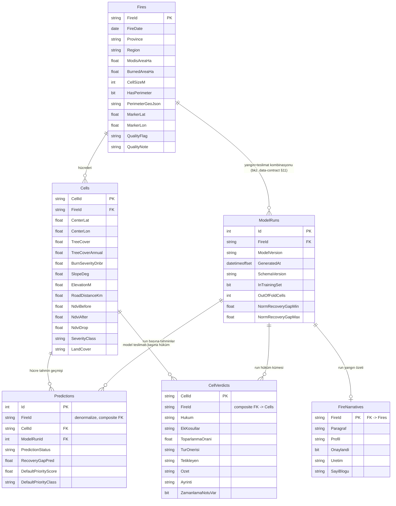

# ReGreen — Veritabanı Şeması (db-schema.md)

**Sürüm:** 1.4
**Kapsam:** Faz 1/2 çekirdek — `Fires`, `Cells`, `ModelRuns`, `Predictions`, `CellVerdicts`, `FireNarratives`, `HukumSozlugu`. Zone/Campaign/Community/Volunteer/Field Observation (Faz 3) bu planın DIŞINDA.
**Dayanak:** [`docs/data-contract.md`](./data-contract.md) v1.5 (alan adı/tip/null/aralık için tek doğru kaynak) + Teknik Mimari Planı v4.1 §7 DDL (başlangıç noktası).
**Kural:** İlk backend şeması ve migration artık bu belgeye göre oluşturuldu. Bu yüzden data-contract.md v1.5'in işaret ettiği PDF v4.1 boşlukları (⚡ ile işaretli) ayrı bir "v4.2 migration"a ertelenmeden doğrudan ilk şemaya gömüldü. SQL karşılığı: [`backend/db/schema.sql`](../backend/db/schema.sql).

**v1.1 değişiklikleri (v1.0 review'ı sonrası, henüz uygulanmadığı için ayrı sürüm açılmadı):**
1. `HasPerimeter=false` senaryosu yarım kalmıştı (marker hâlâ perimeter'a bağımlıydı) — geri alındı, bu paket için `HasPerimeter` sabit `1`'e zorlandı, `PerimeterGeoJson` tekrar `NOT NULL`.
2. `Predictions`'taki 3 ayrı CHECK, data-contract §6.2 "KESİN TABLO"yu tam uygulamıyordu (ör. `no_data + DefaultPriorityClass='YUKSEK'` geçerdi) — tek birleşik CHECK ile değiştirildi.
3. `Cells` ve `ModelRuns` ayrı FK'lerle bağlıyken bir hücrenin yanlış yangının `ModelRun`'ına bağlanması DB seviyesinde engellenmiyordu — `Predictions`'a denormalize `FireId` + composite FK eklendi.
4. `IX_Predictions_CellId_ModelRunId`, `UNIQUE (CellId, ModelRunId)` ile birebir tekrardı — kaldırıldı, yerine sorgu yönüne uygun `IX_Predictions_ModelRunId_CellId` eklendi.
5. Teslim paketinden gelmesi GEREKEN alanlarda (ağırlıklar, eşikler, `HasPerimeter`, `QualityFlag`, `OutOfFoldCells`, `CellSizeM`) `DEFAULT` kaldırıldı — importer bir alanı okumayı unutursa DB sessizce varsayılan yazmasın, hata versin. Sadece `ImportedAt` (kaynakta olmayan, DB'nin ürettiği tek alan) `DEFAULT` tutuyor. Ayrıca `ModelRuns`'a 4 yeni tutarlılık CHECK'i eklendi (OOF/InTrainingSet, ağırlık toplamı, norm min≤max, eşik sıralaması).

**v1.2 değişiklikleri (v1.1 review'ı sonrası):**
1. SQL Server'ın `CHECK` ifadelerinde `UNKNOWN` sonucunu kabul etmesi nedeniyle `low_severity` dalına `DefaultPriorityScore IS NOT NULL` ve `DefaultPriorityClass IS NOT NULL` koşulları eklendi; §6.2 kesin tablosu artık NULL değerlerle aşılamaz.
2. `UNIQUE (FireId, CellId)` zaten `FireId` önekli indeks sağladığı için tekrarlı `IX_Cells_FireId` kaldırıldı.
3. Composite FK'lerin EF Core karşılığına `HasPrincipalKey(...)` yapılandırması eklendi.
4. Kaynaktaki UTC offsetli ISO 8601 `generated_at` değerini kayıpsız saklamak için `ModelRuns.GeneratedAt`, `DATETIME2` yerine `DATETIMEOFFSET(0)` yapıldı.

**v1.3 değişiklikleri (gerçek `ImportTool` implementasyonu + LocalDB üzerinde uçtan uca test sonrası):**
1. EF Core migration'ının composite FK'ler için otomatik ürettiği iki destek indeksi (`IX_Predictions_FireId_CellId`, `IX_Predictions_FireId_ModelRunId`) artık `backend/db/schema.sql`'de de var — §6'daki "EF migration ile schema.sql birebir aynı" iddiası artık gerçekten doğru.
2. `Fires.PerimeterGeoJson` ↔ mevcut kayıt karşılaştırması artık ham JSON metni değil; geometriler normalize edildikten sonra `EqualsExact(..., 1e-9)` ile koordinat bazlı yapılıyor (`ImportTool/Import/EntityComparer.cs`) — whitespace, property sırası, ring başlangıcı veya yönü değişince aynı geometri yanlışlıkla reddedilmiyor.

**v1.4 değişiklikleri (hüküm katmanı eklendi — docs/hukum_sozlesmesi.md, AI ekibinin ayrı teslimatı):**
1. Yeni tablolar: `CellVerdicts` (hücre + ModelRun başına hüküm/gerekçe), `FireNarratives` (ModelRun başına yangın özeti + sayı bloğu), `HukumSozlugu` (sürüm başına global sözlük) — bkz. §9.
2. Üçü de mevcut Faz 1/2 tablolarına (`Fires`/`Cells`/`ModelRuns`/`Predictions`) hiçbir değişiklik yapmaz — tamamen katmanlı ekleme, geriye dönük uyumlu.
3. `CellVerdicts`, `Predictions`'takiyle AYNI composite FK desenini (`(FireId, CellId)` → `Cells` alternate key) kullanır — hücrenin yanlış yangının hükmüne bağlanması aynı şekilde DB seviyesinde engellenir.

---

## 1. İlişki Şeması



`HukumSozlugu` (`FireId`'siz, sürüm başına global satır) yukarıdaki ilişki grafiğinin DIŞINDA — bkz. §9.3.

**Neden `ModelRuns.FireId`:** `normalization_reference`, `in_training_set`, `out_of_fold_cells` fire'a özeldir (data-contract §8.3, §9.3) — tek bir AI teslimatı (53 yangın) 53 ayrı `ModelRuns` satırı üretir, aynı teslimatın satırları `ModelVersion`+`GeneratedAt` ile eşleşir. Bu PDF v4.1'in zaten doğru kurduğu tasarım, değişmiyor (bkz. data-contract §11, §12/v1.3 notu).

**Neden `Predictions.FireId` (denormalize):** `CellId` ve `ModelRunId` ayrı ayrı FK olsaydı, `AKD` yangınına ait bir hücre yanlışlıkla `EGE` yangınının `ModelRun`'ına bağlanabilirdi ve DB bunu sessizce kabul ederdi — bu, normalizasyon fire-bazlı olduğu için (§8.2) sessizce yanlış `priority_score` üretir. `FireId`'yi `Cells(FireId, CellId)` ve `ModelRuns(FireId, Id)`'ye composite FK yaparak "hücre ve model run aynı yangına ait olmalı" kuralı DB seviyesinde garanti ediliyor (§5).

---

## 2. `Fires`

| Kolon | Tip | Null? | Kısıt / Not | Contract karşılığı |
|---|---|---|---|---|
| `FireId` | `NVARCHAR(50)` | Hayır | **PK** | `fire_id` |
| `FireDate` | `DATE` | Hayır | ⚡ PDF'de `NOT NULL` yoktu, eklendi — 53/53 dosyada dolu (doğrulandı) | `fire_date` |
| `Province` | `NVARCHAR(100)` | Hayır | ⚡ aynı sebep | `province` |
| `Region` | `NVARCHAR(100)` | Hayır | ⚡ aynı sebep | `region` |
| `ModisAreaHa` | `FLOAT` | Hayır | ⚡ aynı sebep — gözlenen aralık 315–57.716 | `modis_area_ha` (§2.1) |
| `BurnedAreaHa` | `FLOAT` | Hayır | ⚡ aynı sebep | `burned_area_ha` (§2.1) |
| `CellSizeM` | `INT` | Hayır | ⚡ v1.1: `DEFAULT` kaldırıldı — metadata'da her zaman var, importer explicit yazmalı | `cell_size_m` |
| `HasPerimeter` | `BIT` | Hayır | ⚡ **v1.1 revizyonu:** `CHECK (HasPerimeter = 1)` — bu paket için sabit. v1.0'da `false` desteklemeye çalışılmıştı ama marker üretimi perimeter'a bağımlı olduğu için yarım kalıyordu (bkz. altındaki not) | `has_perimeter` (§2.1, §9.3) |
| `PerimeterGeoJson` | `NVARCHAR(MAX)` | Hayır | ⚡ v1.1: tekrar `NOT NULL` (v1.0'da nullable yapılmıştı, geri alındı) | — |
| `MarkerLat`, `MarkerLon` | `FLOAT` | Hayır | Import sırasında `PerimeterGeoJson`'dan `InteriorPoint` ile hesaplanır (§7.2) | — |
| `QualityFlag` | `NVARCHAR(10)` | Hayır | ⚡ v1.1: `DEFAULT` kaldırıldı, `CHECK (QualityFlag IN ('ok','check'))` kaldı | `quality_flag` |
| `QualityNote` | `NVARCHAR(300)` | **Evet** | `check` iken hemen hemen her zaman dolu, ama `ok` iken de dolu olabilir (`AKD_2021_11` istisnası — bkz. data-contract §9.3) — panel mantığı bu alana değil `QualityFlag`'e bakmalı | `quality_note` |

> **`HasPerimeter=false` neden şimdi desteklenmiyor:** Marker (`MarkerLat/Lon`) şu an SADECE perimeter'dan `InteriorPoint` ile üretiliyor. Perimeter yoksa marker'ın nereden geleceği (ör. hücrelerin bounding box'ı, merkez ortalaması) tanımlı değil — bunu tanımlamadan `HasPerimeter` alanını "gerçekten opsiyonel" yapmak yarım bir özellik olurdu. Şu an 53/53 yangında perimeter var; `false` senaryosu gerçekten gerekirse önce marker fallback'i ayrı bir karar olarak tasarlanmalı, sonra bu kısıt gevşetilmeli.

---

## 3. `Cells`

| Kolon | Tip | Null? | Kısıt / Not | Contract karşılığı |
|---|---|---|---|---|
| `CellId` | `NVARCHAR(50)` | Hayır | **PK**, global benzersiz (37.163/37.163 doğrulandı) | `cell_id` |
| `FireId` | `NVARCHAR(50)` | Hayır | ⚡ PDF'de `NOT NULL` yoktu (FK olmasına rağmen) — eklendi. **FK →** `Fires(FireId)`. Ayrıca `UNIQUE (FireId, CellId)` — `Predictions`'ın composite FK'si için (§5) | `fire_id` |
| `CenterLat`, `CenterLon` | `FLOAT` | Hayır | Kare backend'de anlık üretilir, saklanmaz (§7.1) | `lat`, `lon` |
| `TreeCover` | `FLOAT` | Hayır | Gözlenen 0,0–1,0 | `tree_cover` |
| `TreeCoverAnnual` | `FLOAT` | **Evet** | 37.163'ün 1.681'inde NULL (doğrulandı) | `tree_cover_annual` |
| `BurnSeverityDnbr` | `FLOAT` | Hayır | Gözlenen 0,10–1,14 | `burn_severity_dnbr` |
| `SlopeDeg` | `FLOAT` | Hayır | Gözlenen 0,0–79,06 | `slope_deg` |
| `ElevationM` | `FLOAT` | **Evet** | 37.163'ün 22'sinde NULL (doğrulandı) — eksikse `no_data` tetiklenir | `elevation_m` |
| `RoadDistanceKm` | `FLOAT` | Hayır | Gözlenen 0,0009–5,21 | `road_distance_km` |
| `NdviBefore` | `FLOAT` | Hayır | ⚡ PDF'de `NULL`'dı — 37.163 satırın TAMAMI tarandı, **0 NULL** bulundu, `NOT NULL`'a çevrildi | `ndvi_before` |
| `NdviAfter` | `FLOAT` | Hayır | ⚡ aynı sebep, 0 NULL doğrulandı | `ndvi_after` |
| `NdviDrop` | `FLOAT` | Hayır | ⚡ aynı sebep, 0 NULL doğrulandı — ayrıca `prediction_status` kural motorunun eşik değişkeni (§6.1) | `ndvi_drop` |
| `SeverityClass` | `NVARCHAR(30)` | Hayır | ⚡ PDF'de `NULL`'dı — 0 NULL doğrulandı, `NOT NULL`'a çevrildi. `CHECK (SeverityClass IN ('dusuk','orta-dusuk','orta-yuksek','yuksek'))` — PDF bu enum'un 4 değerli olduğunu bilmiyordu | `severity_class` |
| `LandCover` | `NVARCHAR(50)` | **Evet** | 1.681 hücrede NULL (`TreeCoverAnnual` ile aynı satırlar). `CHECK (LandCover IS NULL OR LandCover IN ('Agaclik','Ciplak','Otlak/calilik','Su','Sulak alan','Tarim','Yerlesim'))` | `land_cover` |

**İndeks:** Ayrı bir `IX_Cells_FireId` oluşturulmaz. `UNIQUE (FireId, CellId)` kısıtının ürettiği indeks `FireId` ile başladığı için `/api/fires/{id}/cells` sorgusunu zaten destekler; aynı önekli ikinci indeks gereksiz yazma/depolama maliyeti oluştururdu.

---

## 4. `ModelRuns`

| Kolon | Tip | Null? | Kısıt / Not | Contract karşılığı |
|---|---|---|---|---|
| `Id` | `INT IDENTITY` | Hayır | **PK** | — |
| `FireId` | `NVARCHAR(50)` | Hayır | ⚡ `NOT NULL` eklendi. **FK →** `Fires(FireId)`. Ayrıca `UNIQUE (FireId, Id)` — `Predictions`'ın composite FK'si için (§5) | — |
| `ModelVersion` | `NVARCHAR(50)` | Hayır | ör. `rf_v1` | `model_version` |
| `GeneratedAt` | `DATETIMEOFFSET(0)` | Hayır | Kaynaktaki ISO 8601 UTC offset'i kayıpsız saklanır | `generated_at` |
| `SchemaVersion` | `NVARCHAR(20)` | Hayır | Import'ta desteklenen sürümle karşılaştırılır | `schema_version` |
| `InTrainingSet` | `BIT` | Hayır | ⚡ **YENİ kolon** — PDF v4.1'de hiç yoktu (34 yangın `true`, 19 `false`, 53/53 doğrulandı) | `in_training_set` |
| `OutOfFoldCells` | `INT` | Hayır | ⚡ **YENİ kolon**, ⚡ v1.1: `DEFAULT` kaldırıldı. `CHECK (OutOfFoldCells >= 0)`, `CHECK (InTrainingSet = 1 OR OutOfFoldCells = 0)`. **`predicted` sayısıyla birebir eşit olmak zorunda DEĞİL** (ör. `AKD_2021_04`: 762 vs 759) — bkz. data-contract §9.3 | `out_of_fold_cells` |
| `NormRecoveryGapMin/Max`, `NormSlopeMin/Max`, `NormRoadDistMin/Max` | `FLOAT` | Hayır | §8.3 `normalization_reference`. ⚡ v1.1: `CHECK (Min <= Max)` her üçü için | `normalization_reference` |
| `DefaultWeightRecovery/Erosion/Access` | `FLOAT` | Hayır | ⚡ v1.1: `DEFAULT` kaldırıldı. `CHECK (hepsi >= 0 AND toplam > 0)` | `priority_weights` |
| `ThresholdVeryHigh/High/Medium` | `FLOAT` | Hayır | ⚡ v1.1: `DEFAULT` kaldırıldı. `CHECK (0 <= Medium < High < VeryHigh <= 1)` | `priority_thresholds` |
| `ImportedAt` | `DATETIME2` | Hayır | `DEFAULT SYSUTCDATETIME()` — kaynakta olmayan TEK alan, `DEFAULT` burada kalıyor | — |

**Kısıt:** `UNIQUE (FireId, ModelVersion, GeneratedAt)` — aynı paket iki kez import edilirse hata verir (idempotency, PDF §8.1).

---

## 5. `Predictions`

| Kolon | Tip | Null? | Kısıt / Not | Contract karşılığı |
|---|---|---|---|---|
| `Id` | `INT IDENTITY` | Hayır | **PK** | — |
| `FireId` | `NVARCHAR(50)` | Hayır | ⚡ **v1.1: YENİ, denormalize kolon** — bkz. §1'deki "Neden Predictions.FireId" açıklaması | — |
| `CellId` | `NVARCHAR(50)` | Hayır | **Composite FK →** `Cells(FireId, CellId)` (v1.1'de ayrı FK'den composite'e çevrildi) | — |
| `ModelRunId` | `INT` | Hayır | **Composite FK →** `ModelRuns(FireId, Id)` (v1.1'de ayrı FK'den composite'e çevrildi) | — |
| `PredictionStatus` | `NVARCHAR(20)` | Hayır | `CHECK (PredictionStatus IN ('predicted','low_severity','no_data'))` | `prediction_status` |
| `RecoveryGapPred` | `FLOAT` | **Evet** | ⚡ v1.1: aralık CHECK'i ayrı tutuldu: `CHECK (RecoveryGapPred IS NULL OR BETWEEN -0.5 AND 1.5)` — durum tutarlılığı artık aşağıdaki BİRLEŞİK CHECK'te | `recovery_gap_pred` |
| `DefaultPriorityScore` | `FLOAT` | **Evet** | ⚡ v1.1: aralık CHECK'i ayrı: `CHECK (DefaultPriorityScore IS NULL OR BETWEEN 0 AND 1)` | `priority_score` |
| `DefaultPriorityClass` | `NVARCHAR(20)` | **Evet** | ⚡ v1.1: enum CHECK'i ayrı: `CHECK (DefaultPriorityClass IS NULL OR IN (4 değer))` | `priority_class` |

**⚡ v1.1 — Birleşik durum-tutarlılık CHECK'i** (`CK_Predictions_StatusConsistency`), v1.0'daki 3 ayrı gevşek CHECK'in yerini aldı. Artık data-contract §6.2'deki "KESİN TABLO" harfiyen uygulanıyor:

```sql
CHECK (
    (PredictionStatus = 'predicted'
        AND RecoveryGapPred IS NOT NULL
        AND DefaultPriorityScore IS NOT NULL
        AND DefaultPriorityClass IS NOT NULL)
 OR (PredictionStatus = 'low_severity'
        AND RecoveryGapPred IS NULL
        AND DefaultPriorityScore IS NOT NULL
        AND DefaultPriorityScore = 0.0
        AND DefaultPriorityClass IS NOT NULL
        AND DefaultPriorityClass = 'DUSUK')
 OR (PredictionStatus = 'no_data'
        AND RecoveryGapPred IS NULL
        AND DefaultPriorityScore IS NULL
        AND DefaultPriorityClass IS NULL)
)
```

`predicted` durumunda skor↔sınıf eşleşmesinin DOĞRU eşiğe göre yapıldığı (ör. skor 0,81 iken sınıf gerçekten `COK_YUKSEK` mi) bu CHECK'te doğrulanmıyor — eşikler `ModelRun`'a göre değişken olduğu için (§4, `ThresholdVeryHigh/High/Medium`) sabit bir CHECK ile ifade edilemez, bu **import katmanının** sorumluluğunda kalıyor. CHECK sadece "predicted ise üçü de dolu olmalı" garantisini veriyor.

**Kısıt:** `UNIQUE (CellId, ModelRunId)` — aynı run içinde bir hücre için tek satır (PDF §8.1).
**İndeks:** ⚡ v1.1: eski `IX_Predictions_CellId_ModelRunId` KALDIRILDI (`UNIQUE (CellId, ModelRunId)` ile birebir tekrardı). Yerine `IX_Predictions_ModelRunId_CellId (ModelRunId, CellId)` eklendi — API akışı önce yangının en güncel `ModelRunId`'sini bulup o run'ın TÜM tahminlerini çekecek (PDF §9), sorgu yönü `ModelRunId` önde olmalı.

> **İmport notu:** Composite FK, `Cells.FireId == ModelRuns.FireId` uyuşmazlığını INSERT anında SQL hatası olarak reddeder ama anlamlı bir mesaj vermez (ham FK constraint hatası sızar). Import script yine de Predictions satırı yazmadan önce CSV'nin `fire_id`'siyle ilgili `ModelRun.FireId`'nin aynı olduğunu kontrol edip anlaşılır bir hata basmalı — composite FK burada son savunma hattı, ilk savunma değil.

---

## 6. Index Stratejisi (özet)

| İndeks | Tablo | Amaç |
|---|---|---|
| `IX_ModelRuns_FireId` | `ModelRuns` | Bir yangının en güncel `ModelRun`'ını bulma (`GeneratedAt DESC`) |
| `IX_Predictions_ModelRunId_CellId` | `Predictions` | Bir `ModelRun`'ın TÜM tahminlerini çekme (v1.1'de yön düzeltildi — bkz. §5) |
| `IX_Predictions_FireId_CellId`, `IX_Predictions_FireId_ModelRunId` | `Predictions` | ⚡ v1.3: composite FK'lerin ((FireId,CellId), (FireId,ModelRunId)) EF Core tarafından otomatik üretilen destek indeksleri — FK enforcement/JOIN performansı için. Zararsız oldukları ve gerçek EF migration'da zaten oluştukları için schema.sql'e de eklendi (aksi halde "EF migration ile schema.sql birebir aynı" iddiası doğru olmazdı) |

`Cells` için ayrı bir indeks satırı yoktur: `UQ_Cells_FireId_CellId UNIQUE (FireId, CellId)` zaten yangına göre hücre listeleme sorgularının ihtiyaç duyduğu `FireId` önekli indeksi üretir.

---

## 7. Neden bazı zorunlu alanlarda `DEFAULT` yok (v1.1)

Ağırlıklar, eşikler, `HasPerimeter`, `QualityFlag`, `OutOfFoldCells`, `CellSizeM` — bunların hepsi data-contract'a göre teslim paketinde HER ZAMAN dolu geliyor (§9.2, §9.3). Eğer bu kolonlara `DEFAULT` verilirse, import script bir alanı okumayı unuttuğunda SQL sessizce varsayılan değeri yazar ve hata hiç görünmez — data-contract'ın "metadata'yı oku, koda gömme" ilkesiyle (§8.2, §8.3) doğrudan çelişir. Bu yüzden bu belgedeki TEK `DEFAULT`, kaynakta hiç bulunmayan `ModelRuns.ImportedAt` alanında kalıyor.

---

## 8. EF Core Uygulaması

Veri erişimi **Entity Framework Core (Code-First)** ile uygulanmıştır. Güncel
karşılıklar `backend/ReGreen.Data/AppDbContext.cs`, entity sınıfları ve
`20260822135150_InitialCreate` migration'ıdır. `backend/db/schema.sql` aynı
şemanın elle çalıştırılabilir referans karşılığı olarak tutulur:

- Tablo adları tekil (`Fires`, `Cells`) değil PDF'nin kullandığı çoğul haliyle kalıyor — EF Core konvansiyonuyla `DbSet<Fire>` → `Fires` tablosu şeklinde eşleşir, ekstra `[Table("Fires")]` gerekmez.
- Yukarıdaki `CHECK` kısıtları EF Core migration'larında `.HasCheckConstraint(...)` ile ifade edilir (Fluent API); Code-First entity class'ları bu kısıtları enforce ETMEZ, sadece DB seviyesinde tutulur — C# tarafında da aynı kuralları (ör. `PredictionStatus == "predicted"` iken üç alan da dolu olmalı) ayrıca doğrulamak gerekir.
- Composite FK'ler primary key yerine alternate composite key'lere bağlandığı için EF Core'da hem `HasForeignKey(...)` hem `HasPrincipalKey(...)` açıkça tanımlanmalı; Code-First konvansiyonu bunu otomatik çıkaramaz:

```csharp
modelBuilder.Entity<Prediction>()
    .HasOne(p => p.Cell)
    .WithMany(c => c.Predictions)
    .HasForeignKey(p => new { p.FireId, p.CellId })
    .HasPrincipalKey(c => new { c.FireId, c.CellId });

modelBuilder.Entity<Prediction>()
    .HasOne(p => p.ModelRun)
    .WithMany(r => r.Predictions)
    .HasForeignKey(p => new { p.FireId, p.ModelRunId })
    .HasPrincipalKey(r => new { r.FireId, r.Id });
```

  `Cells(FireId, CellId)` ve `ModelRuns(FireId, Id)` için alternate key'ler migration'da `UNIQUE` kısıtlarına karşılık gelmelidir.
- İlk migration `InitialCreate` adıyla oluşturulmuştur. v1.2 düzeltmeleri ilk
  migration'a gömülüdür; ayrıca bir "v4.2 fix" migration'ı yoktur.
- Hüküm katmanı (§11) `AddHukumKatmani` adında AYRI, ikinci bir migration olarak
  eklenmiştir (`InitialCreate`'e gömülmedi) — `CellVerdicts`, `FireNarratives`,
  `HukumSozlugu` tablolarını ve CHECK kısıtlarını oluşturur, mevcut tabloları değiştirmez.

EF Core modeli, migration ve `backend/db/schema.sql` testler ve şema incelemesiyle
birbirleriyle hizalanmıştır.

---

## 9. Hüküm Katmanı — `CellVerdicts`, `FireNarratives`, `HukumSozlugu`

**Kaynak:** [`docs/hukum_sozlesmesi.md`](./hukum_sozlesmesi.md) (AI ekibinin "hüküm katmanı" veri sözleşmesi, sürüm 1.3). Bu üç tablo mevcut Faz 1/2 şemasına (`Fires`/`Cells`/`ModelRuns`/`Predictions`) EKLENDİ — hiçbirini değiştirmiyor. Kaynak dosyalar (`{fire_id}_hukumler.csv`, `hukum_sozlugu.json`, `yangin_ozetleri.json`, `yangin_metinleri.json`) `manifest.json`'un `files_per_fire` listesinde BİLEREK yok — AI ekibinin ayrı, opsiyonel bir yan-teslimatı (bkz. docs/import-flow.md §3.8).

**Temel ilke:** hüküm aktif ağırlık kaydırıcısından bağımsızdır; fakat `recovery_gap_pred` kullandığı için **ModelRun'a bağlıdır**. Yeni model teslimatı aynı hücre için farklı hüküm üretebilir; eski run'ın hükmü korunur.

### 9.1. `CellVerdicts`

| Kolon | Tip | Null? | Kısıt / Not | Contract karşılığı |
|---|---|---|---|---|
| `CellId` | `NVARCHAR(50)` | Hayır | **Composite PK (`CellId`,`ModelRunId`,`HukumSozluguSurum`)** + FK parçası | `cell_id` |
| `FireId` | `NVARCHAR(50)` | Hayır | Composite FK'nin diğer yarısı | `{fire_id}_hucreler.csv`'den türetilir (hukumler.csv'de `fire_id` kolonu yok) |
| `ModelRunId` | `INT` | Hayır | Composite FK → `ModelRuns(FireId,Id)`; hükmün üretildiği teslimat | importer tarafından atanır |
| `HukumSozluguSurum` | `NVARCHAR(20)` | Hayır | FK → `HukumSozlugu(Surum)` | `hukum_sozlugu.json.surum` |
| `Hukum` | `NVARCHAR(20)` | Hayır | `CHECK (Hukum IN (7 değer))`: `KAPSAM_DISI, SAHA_KONTROL, IZLE, EROZYON_ONCE, DIKIM_ADAYI, ONCELIGE_GORE, GENCLESME_IZLE` | `hukum` |
| `EkKosullar` | `NVARCHAR(120)` | **Evet** | `\|` ile ayrılmış 0..6 kod (`ERISIM_ZOR, ESKIDEN_ORMAN_DEGIL, SEYREK_ORTU, DIK_YAMAC, AGIR_YANMIS, DUSUK_GUVEN`). CSV'deki boş alan NULL'a çevrilir (ImportTool CsvHelper ayarı, `_hucreler.csv`'nin `land_cover` kolonuyla aynı davranış) | `ek_kosullar` |
| `ToparlanmaOrani` | `FLOAT` | **Evet** | `CHECK (ToparlanmaOrani IS NULL OR BETWEEN 0 AND 1)` | `toparlanma_orani` |
| `TurOnerisi` | `NVARCHAR(500)` | **Evet** | Virgüllü tür listesi — **onaylanmamış örnek veri** (bkz. `hukum_sozlugu.json → tur_tablosu.onaylandi=false`); UI bu uyarıyı göstermeden `tur_onerisi`'ni yayınlamamalı | `tur_onerisi` |
| `Tetikleyen` | `NVARCHAR(300)` | Hayır | Denetim izi, ör. `toparlanma=0.27 egim=36.0>=25 <0.35` | `tetikleyen` |
| `Ozet` | `NVARCHAR(MAX)` | Hayır | Panelde üstte gösterilecek 1-2 cümle | `ozet` |
| `Ayrinti` | `NVARCHAR(MAX)` | Hayır | Detay bölümündeki gerekçe + ek koşullar | `ayrinti` |
| `ZamanlamaNotuVar` | `BIT` | Hayır | `true` ise `HukumSozlugu.JsonIcerik → zamanlama_notu` panelin altında tek dipnot olarak gösterilir | `zamanlama_notu_var` |

**İlişki:** Her `(CellId, ModelRunId, HukumSozluguSurum)` için en fazla bir hüküm; aynı model çıktısı yeni kural/sözlük sürümüyle yeniden yorumlanabilir.

### 9.2. `FireNarratives`

| Kolon | Tip | Null? | Kısıt / Not | Contract karşılığı |
|---|---|---|---|---|
| `ModelRunId` | `INT` | Hayır | **Composite PK (`ModelRunId`,`NarrativeVersion`)**, FK → `ModelRuns(FireId,Id)` | importer tarafından atanır |
| `FireId` | `NVARCHAR(50)` | Hayır | FK → `Fires(FireId)` ve ModelRun composite FK parçası | `fire_id` |
| `NarrativeVersion` | `NVARCHAR(20)` | Hayır | Anlatı sözleşmesi/üretici sürümü | `yangin_metinleri.json.surum` |
| `Paragraf` | `NVARCHAR(MAX)` | Hayır | Bölge seçilince gösterilecek tek paragraf (517–1.086 karakter, medyan 728) | `yangin_metinleri.json → yanginlar[fire_id].paragraf` |
| `Profil` | `NVARCHAR(30)` | Hayır | `CHECK (Profil IN (6 değer))`: `yogun_mudahale, karisik, kendi_toparlaniyor, dik_arazi, belirsiz, kapsam_dar` | `...profil` |
| `Onaylandi` | `BIT` | Hayır | | `...onaylandi` |
| `Uretim` | `NVARCHAR(100)` | Hayır | Üretim yöntemi (ör. `"sablon (deterministik)"`) — kaynak JSON'da fire başına DEĞİL, dosyanın ÜST seviyesinde tek bir alan; her yangına aynı değer kopyalanır | `yangin_metinleri.json → uretim` (üst seviye) |
| `SayiBlogu` | `NVARCHAR(MAX)` | Hayır | Paragrafın dayandığı ham sayı bloğu — opak JSON, `Fires.PerimeterGeoJson` ile AYNI teknikle (`JsonDocument.Parse(...).RootElement.Clone()`) API'de aynen geçirilir, alan alan modellenmez | `yangin_ozetleri.json → yanginlar[fire_id]` (tüm blok) |

**İlişki:** ModelRun ve anlatı sürümü başına opsiyonel satır; yeni model veya anlatı sürümü eskisini ezmez.

### 9.3. `HukumSozlugu`

Yangına özgü değildir; **sürüm başına bir global satır** tutulur. Böylece sözlüğün yeni sürümü eski hükümlerin anlamını bozmaz.

| Kolon | Tip | Null? | Kısıt / Not | Contract karşılığı |
|---|---|---|---|---|
| `Surum` | `NVARCHAR(20)` | Hayır | **PK**, ör. `"1.2"`; aynı sürüm farklı içerikle gelemez | `surum` |
| `JsonIcerik` | `NVARCHAR(MAX)` | Hayır | Dosyanın TAMAMI, ham JSON — `hukumler[]`, `ek_kosullar{}`, `zamanlama_notu`, `esikler{}`, `tur_tablosu{}`, `aciklama` dahil | (dosyanın tamamı) |
| `ImportedAt` | `DATETIMEOFFSET` | Hayır | `DEFAULT SYSUTCDATETIME()` — `ModelRuns.ImportedAt` ile AYNI "kaynakta olmayan, DB'nin ürettiği alan" deseni (bkz. §7) | — |

**İmport notu:** Aynı `Surum` mevcutsa içerik birebir doğrulanır; farklı içerik FATAL, yeni sürüm ise yeni satırdır.

---

## 10. Kapsam Dışı (Faz 3)

`Zone`, `Campaign`, `Community`, `Volunteer`, `FieldObservation` tabloları bu planda YOK — ne şema ne de yer tutucu FK. data-contract.md ve PDF v4.1 ile aynı sınır korunuyor: bu modüller ayrı bir mimari dokümanla ele alınacak.

---

## 11. Kaynak Dosyalar

- [`docs/data-contract.md`](./data-contract.md) v1.5 — alan adı/tip/null/aralık/enum için tek doğru kaynak
- [`docs/hukum_sozlesmesi.md`](./hukum_sozlesmesi.md) — hüküm katmanının (§11) veri sözleşmesi ve semantiği
- `ReGreen_Teknik Mimari Planı.pdf` v4.1 §7 — bu şemanın başlangıç noktası olan DDL
- [`backend/db/schema.sql`](../backend/db/schema.sql) — bu belgenin çalıştırılabilir SQL karşılığı
