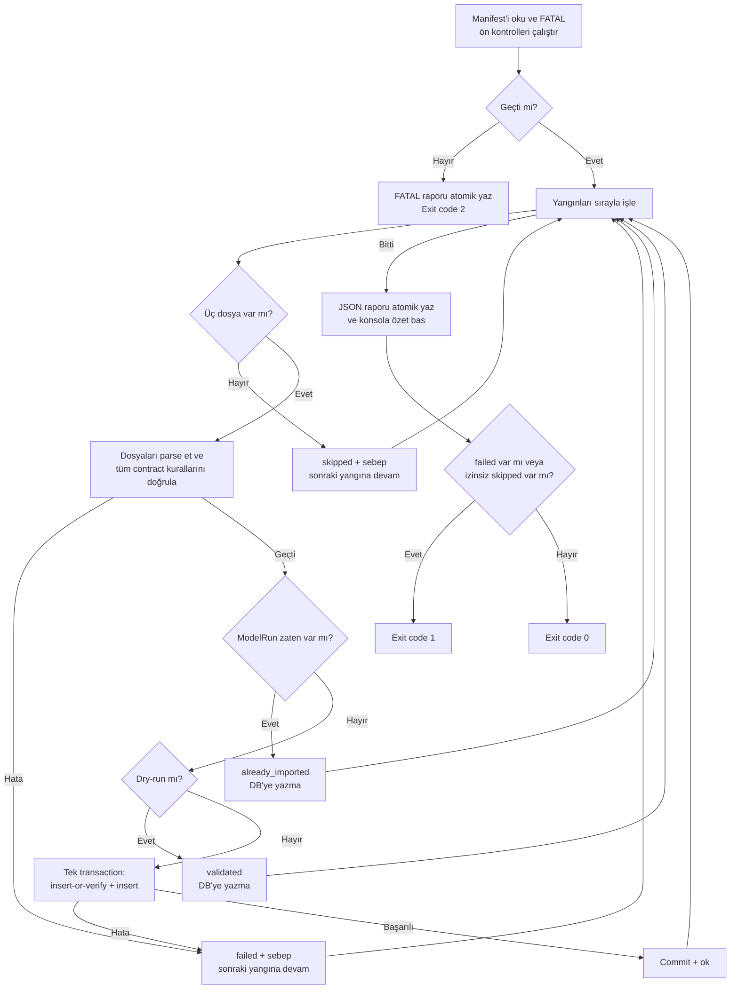

# ReGreen — Import Akışı (import-flow.md)

**Sürüm:** 1.3 (uygulandı ve test edildi — `backend/ImportTool`, gerçek LocalDB + `sample-data/backend-data` 53 yangınlık paketle uçtan uca doğrulandı)
**Kapsam:** AI teslim paketinin (`manifest.json` + yangın başına 3 dosya) veritabanına aktarılması + hüküm katmanının (docs/hukum_sozlesmesi.md) opsiyonel yan dosyalarının içe aktarılması (§3.8). Faz 1/2 çekirdek.
**Dayanak:** [`docs/data-contract.md`](./data-contract.md) v1.5, [`docs/hukum_sozlesmesi.md`](./hukum_sozlesmesi.md) (hüküm katmanı), [`docs/db-schema.md`](./db-schema.md) v1.4 + [`backend/db/schema.sql`](../backend/db/schema.sql), Teknik Mimari Planı v4.1 §8 (başlangıç noktası).
**Kural:** PDF §8'in belirtmediği veya kendi içinde çeliştiği davranışlar bu belgede açıkça tanımlanır. Importer, contract'ta olmayan alan adı, varsayılan değer veya tolerans üretmez.

---

## 1. CLI Arayüzü

```text
dotnet run --project ImportTool -- <manifest-yolu> [--dry-run] [--allow-partial] [--report <rapor-yolu>]
```

| Parametre | Zorunlu? | Açıklama |
|---|---|---|
| `<manifest-yolu>` | Evet | `manifest.json` dosyasının yolu. Importer yalnızca bu manifest'i ve onun bildirdiği dosyaları okur; klasör taramaz |
| `--dry-run` | Hayır | Tüm dosya/DB doğrulamaları çalışır; hiçbir transaction, `INSERT` veya `UPDATE` çalışmaz. DB bağlantısı global kimlik ve idempotency kontrolleri için yine gereklidir |
| `--allow-partial` | Hayır | Yalnızca `skipped` yangınlar varsa sürecin exit code `0` vermesine izin verir. `failed` veya FATAL hata hiçbir zaman bu seçenekle bastırılmaz |
| `--report <yol>` | Hayır | Verilmezse çalışma dizinine UTC ve benzersiz run kimliği içeren `import-report-{yyyyMMdd-HHmmssfff}-{runId}.json` yazılır |

Tüm yollar manifest dosyasının bulunduğu klasöre göre çözülür. Çözülen mutlak yolun bu klasörün dışına çıkmasına (`..`, köklü yol veya benzeri path traversal) izin verilmez.

---

## 2. Genel Akış ve Hata Seviyeleri



- **FATAL (paket düzeyi):** Manifest bulunamıyor/parse edilemiyor, manifest şeması geçersiz, `manifest.schema_version` desteklenmiyor, `fire_count`/`total_cells` manifest'in kendi içindeki değerlerle uyuşmuyor veya rapor güvenilir biçimde yazılamıyor. Yangın işlemeye başlanmaz; mümkünse FATAL raporu yazılır ve exit code `2` verilir.
- **`skipped` (yangın düzeyi):** Manifest'te ilan edilen üç dosyadan en az biri yoktur. Yangına ait hiçbir kayıt yazılmaz; diğer yangınlara devam edilir.
- **`failed` (yangın düzeyi):** Dosya var olduğu halde parse, contract, tutarlılık veya DB işlemi başarısızdır. Yangına ait transaction rollback edilir; diğer yangınlara devam edilir.
- **`already_imported`:** Aynı `(FireId, ModelVersion, GeneratedAt)` daha önce başarıyla yazılmıştır. Hata değildir ve yeniden yazma yapılmaz.

`skipped` ile tamamlanan çalışma **kısmi importtur**. Varsayılan olarak exit code `1` üretir; yalnızca operatör açıkça `--allow-partial` verdiyse ve hiçbir `failed`/FATAL hata yoksa exit code `0` olabilir. Raporun üst seviye durumu her iki durumda da `partial` kalır.

---

## 3. Doğrulama Adımları

### 3.1. Manifest düzeyinde (FATAL — bir kez, en başta)

1. Dosya bulunmalı, UTF-8 JSON olarak parse edilmeli ve data-contract §9.2'deki zorunlu alan adları/tipleri/null kurallarını karşılamalıdır. Bilinmeyen alanlar loglanabilir; zorunlu alan eksikliği FATAL'dır.
2. `manifest.schema_version` backend'in açıkça desteklediği sürümlerden biri olmalıdır (bu paket için `"1.1"`). Parser sürümü tahmin edilmez.
3. `fires[].fire_id` değerleri manifest içinde benzersiz olmalıdır.
4. `manifest.fire_count == fires[].Count` ve `manifest.total_cells == Sum(fires[].cell_count)` olmalıdır. Uyuşmazlık paket bütünlüğü hatasıdır ve FATAL'dır.
5. `files_per_fire` şablonları güvenli biçimde çözülmeli; çözülen her yol manifest klasörü altında kalmalıdır.
6. Manifest ağırlıkları/eşikleri contract'taki key setini, sayısal tipleri ve temel kuralları sağlamalıdır: ağırlıklar negatif olamaz ve toplamları pozitif olmalıdır; `0 <= ORTA < YUKSEK < COK_YUKSEK <= 1` olmalıdır.

### 3.2. Yangın düzeyinde sınıflandırma

Kontroller sırasıyla çalışır. İlk hata o yangın için işlemi bitirir:

1. **Dosya yokluğu → `skipped`:** `{fire_id}_hucreler.csv`, `{fire_id}_sinir.geojson`, `{fire_id}_metadata.json` dosyalarından biri yoksa sebep ve eksik yol raporlanır.
2. **Dosya mevcut fakat okunamıyor/geçersiz → `failed`:** UTF-8, CSV veya JSON parse hataları `skipped` sayılmaz.
3. **Diğer tüm contract/DB tutarsızlıkları → `failed`:** Aşağıdaki doğrulamalardan herhangi birinin başarısız olması yangını reddeder.

### 3.3. Metadata ve dosyalar arası tutarlılık

1. Metadata, data-contract §9.3'teki tüm zorunlu alanları, tipleri, null davranışlarını ve enum'ları karşılamalıdır.
2. Aşağıdaki tekrar alanları birebir tutarlı olmalıdır:
   - `manifest.fire_id/fire_date/province/region/cell_count/burned_area_ha/quality_flag/has_perimeter` ↔ metadata karşılıkları
   - `manifest.schema_version/model_version/generated_at/cell_size_m/crs` ↔ metadata karşılıkları
   - Manifest ve metadata `priority_weights`/`priority_thresholds` key setleri ve değerleri
   - Metadata `status_counts` ↔ manifest yangın kaydı
3. `metadata.schema_version`, önce doğrulanmış `manifest.schema_version` ile aynı ve desteklenen sürüm olmalıdır. Bu kontrol yangın düzeyindedir; uyuşmazlık yalnızca ilgili yangını `failed` yapar.
4. `normalization_reference` tam olarak `recovery_gap_pred`, `slope_deg`, `road_distance_km` keylerini ve her biri için sayısal `{min,max}` değerlerini taşımalıdır. Her çiftte `min <= max` olmalıdır. Referanslar, CSV'deki yalnızca `predicted` satırlardan hesaplanan gerçek min/max ile aynı olmalıdır.
5. `in_training_set == false` ise `out_of_fold_cells == 0`; her durumda `out_of_fold_cells >= 0` olmalıdır. `out_of_fold_cells`, `predicted` sayısıyla eşit olmak zorunda değildir.

### 3.4. CSV şema ve satır doğrulamaları

1. Header, data-contract §9.1'deki 19 kolonu aynı ad ve sırayla içermelidir. Eksik/fazla/tekrarlı kolon reddedilir.
2. Her değer data-contract §2–§6'daki veri tipi, zorunluluk, null/missing, enum, birim ve kesin validasyon kurallarını sağlamalıdır. Sayılar invariant culture ile parse edilir; `NaN`/`Infinity` kabul edilmez.
3. Tüm CSV satırlarının `fire_id` değeri manifest ve metadata `fire_id` değeriyle aynı olmalıdır.
4. `cell_id`, data-contract'taki formatı sağlamalı; dosya içinde ve bu import oturumundaki diğer yangınlarda tekrarlanmamalıdır.
5. DB'de aynı `CellId` başka bir `FireId` altında bulunuyorsa yangın reddedilir. Aynı yangında varsa §4'teki değişmez alan karşılaştırması uygulanır.
6. CSV satır sayısı manifest ve metadata `cell_count` ile aynı olmalıdır.
7. CSV `prediction_status` dağılımı manifest/metadata `status_counts` ile aynı olmalıdır. Objede bulunmayan izinli status keyi `0` kabul edilir; bilinmeyen key reddedilir.
8. `recovery_gap_pred` doluysa `-0.5 <= x <= 1.5` olmalıdır. Aralık dışı değer PDF v4.1 §3.7 ve DB `CK_Predictions_RecoveryGapPred_Range` ile uyumlu olarak reddedilir.
9. Data-contract §6.2 durum tablosu birebir uygulanır:
   - `predicted`: `recovery_gap_pred`, `priority_score`, `priority_class` dolu
   - `low_severity`: `recovery_gap_pred` null, `priority_score == 0.0`, `priority_class == DUSUK`
   - `no_data`: üç alan da null
10. `priority_score` aralığı `0..1` olmalıdır.

### 3.5. GeoJSON doğrulamaları

1. Kök nesne GeoJSON `Feature`, `geometry.type` ise `Polygon` veya `MultiPolygon` olmalıdır.
2. Geometry boş olmamalı, koordinatlar sonlu sayılar olmalı, geçerli CRS/eksen düzeninde bulunmalı ve NetTopologySuite ile geçerli geometri oluşturmalıdır.
3. `Feature.properties`, sample data ve data-contract §7.2'deki gerçek 5 alanı taşımalıdır: `fire_id`, `fire_date`, `province`, `region`, `modis_area_ha`. Bu değerler manifest/metadata'daki karşılıklarıyla tutarlı olmalıdır; `quality_flag`/`quality_note` GeoJSON'da beklenmez.
4. Mevcut şema bu paket için `HasPerimeter = 1` ve `PerimeterGeoJson NOT NULL` istediğinden `metadata.has_perimeter` true olmalı ve geçerli sınır dosyası bulunmalıdır.
5. Marker, centroid ile değil NetTopologySuite `Geometry.InteriorPoint` ile üretilmeli ve elde edilen nokta geometri içinde olmalıdır.

### 3.6. Priority yeniden hesaplama ve sınıflandırma

Bu iki kontrol birbirinden ayrıdır ve yalnızca `predicted` satırlara uygulanır:

1. **Skor doğrulaması:** `oncelik.py` C# portu; metadata `normalization_reference` değerleri ve metadata ağırlıklarıyla `priority_score` değerini yeniden hesaplar. Ağırlıklar önce toplamları 1 olacak şekilde normalize edilir; normalizasyon 0–1'e kırpılır; `max-min < 1e-9` ise normalize değer `0.5` olur; erişim terimi `1-n(road_distance_km)` olarak kullanılır. Sonuç NumPy/Pandas davranışıyla uyumlu biçimde 4 ondalığa, orta noktada en yakın çift sayıya (`MidpointRounding.ToEven`) yuvarlanır ve CSV'deki 4 ondalıklı değerle eşit olmalıdır. Ham binary `double` eşitliği kullanılmaz.
2. **Sınıf doğrulaması:** Doğrulanan `priority_score`, metadata eşikleriyle karşılaştırılır ve üretilen sınıf CSV `priority_class` değeriyle birebir aynı olmalıdır.

Sample data taramasında yeniden hesaplanan skor farkı tüm satırlarda `0.0` bulunmuştur; importer aynı kuralı her yeni teslimatta yeniden doğrular.

### 3.7. DB salt-okunur kontrolleri ve dry-run

Dosya doğrulamaları tamamlandıktan sonra, yazmadan önce:

1. `(FireId, ModelVersion, GeneratedAt)` mevcutsa durum `already_imported` olur; transaction açılmaz.
2. Global `CellId` çakışmaları ve mevcut kayıtların değişmez alanları kontrol edilir.

Dry-run modunda §3'ün tamamı, DB salt-okunur sorguları dahil çalışır. Başarılı ve daha önce import edilmemiş yangın `validated`; mevcut run `already_imported` olur. Hiçbir transaction/`INSERT`/`UPDATE` açılmaz.

### 3.8. Hüküm katmanı — opsiyonel yan dosyalar

docs/hukum_sozlesmesi.md'deki "hüküm katmanı", AI ekibinin ana teslim paketinden AYRI, opsiyonel bir yan-teslimattır. Dört dosya `manifest.json`'un `files_per_fire` listesinde BİLEREK yok; bulunmazlarsa hüküm katmanı sessizce atlanır — hata DEĞİL, backward-compatible no-op. İki farklı seviyede çözülürler:

1. **Yangın düzeyinde, opsiyonel (`FireValidator`):** `{fire_id}_hukumler.csv` — `{fire_id}_hucreler.csv` gibi §3.1.5'teki güvenli path çözümüyle (`{fire_id}` yerine konur, path traversal engellenir) ama `files_per_fire` şablonlarından BAĞIMSIZ, doğrudan `Path.Combine` ile aranır. `File.Exists` ile kontrol edilir:
   - Yoksa: bu yangının hüküm verisi yok, `FireImportData.HukumRows = null`. Hata değildir.
   - Varsa: CSV parse edilir (data-contract §9.1'in `_hucreler.csv` okuma deseniyle AYNI CsvHelper yapılandırması — boş alan `null` sayılır) ve doğrulanır:
     - `hukum` 7 bilinen koddan biri olmalı, değilse `HUKUM_INVALID_VALUE`.
     - `ek_kosullar` (varsa) `\|` ile ayrılan her kod 6 bilinen koddan biri olmalı, `toparlanma_orani` (varsa) `0..1` aralığında ve sonlu olmalı — aksi `HUKUM_INVALID_VALUE`.
     - `cell_id` kümesi, aynı yangının `_hucreler.csv`'sindeki `cell_id` kümesiyle **1:1 BİREBİR** eşleşmeli (fazla/eksik/tekrarlı `cell_id` → `HUKUM_CELL_MISMATCH`). Header uyuşmazlığı/parse hatası sırasıyla `HUKUM_CSV_HEADER_MISMATCH`/`HUKUM_CSV_PARSE_ERROR` ile raporlanır (`_hucreler.csv`'nin `CSV_HEADER_MISMATCH`/`CSV_PARSE_ERROR` kodlarıyla aynı desen).

2. **Paket düzeyinde, opsiyonel (`Orchestrator`):** `hukum_sozlugu.json` (GLOBAL, tek sözlük) ve `yangin_ozetleri.json`/`yangin_metinleri.json` (fire_id ile anahtarlanmış TEK dosya, per-fire DEĞİL) — manifest'in yanında, yangın döngüsünden ÖNCE bir kez okunur:
   - Hüküm CSV'si varsa `hukum_sozlugu.json` zorunludur (`HUKUM_SOZLUGU_REQUIRED`). Sözlük sürüm başına insert-or-verify edilir; aynı sürüm farklı içerikle gelirse `HUKUM_SOZLUGU_MISMATCH`, yeni sürümse yeni satırdır.
   - `yangin_metinleri.json` ve `yangin_ozetleri.json` birlikte bulunmalıdır; tek dosya `NARRATIVE_FILE_PAIR_INCOMPLETE` ile FATAL olur. Sürümleri eşleşmeli ve her manifest yangını iki dosyada da bulunmalıdır; eksik fire_id `NARRATIVE_FIRE_MISSING` ile o yangını reddeder.

`FireImportData`, bu opsiyonel verileri taşıyacak şekilde genişletildi: `HukumRows` (`FireValidator` tarafından doldurulur, `init`), `Narrative` (paket-geneli olduğu için `FireValidator` DEĞİL `Orchestrator` tarafından, doğrulama başarıyla döndükten SONRA atanır — bilerek mutable).

---

## 4. Yangın Başına Yazma İşlemi

Yazma sırasında kör `UPSERT` yapılmaz. `Fires` ve `Cells` kaynak kimliği/sabit özellik taşır; sonraki teslimatın bunları sessizce değiştirmesi eski `ModelRuns`/`Predictions` kayıtlarının anlamını geriye dönük bozar.

```text
BEGIN TRANSACTION
    1. Fires insert-or-verify
       - Yoksa metadata + GeoJSON + InteriorPoint ile INSERT.
       - Varsa FireDate, Province, Region, ModisAreaHa, BurnedAreaHa, CellSizeM,
         HasPerimeter, PerimeterGeoJson, MarkerLat/Lon, QualityFlag ve QualityNote
         karşılaştırılır; fark varsa failed. Otomatik UPDATE yapılmaz.
    2. Cells insert-or-verify
       - Yoksa INSERT.
       - Varsa FireId dahil tüm data-contract §3/§4 sabit alanları karşılaştırılır;
         fark varsa failed. Otomatik UPDATE yapılmaz.
    3. ModelRuns INSERT; Id üretilir
    3b. CellVerdicts (CellId + ModelRunId) insert-or-verify
       - Yoksa INSERT. Varsa Hukum/EkKosullar/ToparlanmaOrani/TurOnerisi/Tetikleyen/
         Ozet/Ayrinti/ZamanlamaNotuVar karşılaştırılır; fark varsa HUKUM_MISMATCH.
    3c. FireNarratives (ModelRunId) insert-or-verify
       - Model teslimatı düzeyinde tekil. Yoksa INSERT. Varsa
         Paragraf/Profil/Onaylandi/Uretim/SayiBlogu karşılaştırılır; fark varsa
         FIRE_NARRATIVE_MISMATCH.
    4. Predictions INSERT
COMMIT
-- herhangi bir hata: ROLLBACK, yangın failed, sonraki yangına devam
```

Karşılaştırmalarda metin/tarih/enum değerleri birebirdir. Kaynaktan yeniden parse edilen sayısal değerler için `abs(a-b) <= 1e-9 * max(1, abs(a), abs(b))`; GeoJSON geometrileri normalize edildikten sonra koordinatlarda `1e-9` derece toleransıyla karşılaştırılır. Marker aynı canonical geometry üzerinden yeniden üretilir. Uyuşmazlıkta alan adı, iki değer ve kullanılan tolerans loglanır. SQL komutları parametreli çalıştırılır; dosya değerleri SQL metnine birleştirilmez.

Tek transaction, `Fires`/`Cells` yazıldıktan sonra `ModelRuns` veya `Predictions` aşamasında hata çıkarsa yarım yangın bırakılmamasını garanti eder.

**Hüküm katmanı SONRADAN gelirse (§3.8, gerçek `sample-data` üzerinde uçtan uca doğrulandı):** Ana veri (`Fires`/`Cells`/`ModelRuns`/`Predictions`) zaten `already_imported` olsa bile — yani `UQ_ModelRuns` anahtarı zaten mevcutsa (§5) — hüküm katmanı (`CellVerdicts`/`FireNarratives`) hâlâ eksikse AYRI, küçük bir transaction'da insert-or-verify edilir. Bu, `hukumler.csv`/anlatı dosyalarının ana teslimattan SONRA, ayrı bir "hüküm katmanı" teslimatı olarak gelebileceği gerçek senaryoyu destekler (bkz. docs/hukum_sozlesmesi.md) — aksi halde erken `already_imported` kısayolu bu veriyi hiçbir zaman yazamazdı. Rapor durumu yine `already_imported` kalır (ana veri açısından "yeni" bir şey olmadı); hüküm katmanında uyuşmazlık varsa `failed` (`HUKUM_MISMATCH`/`FIRE_NARRATIVE_MISMATCH`) döner.

---

## 5. Idempotency ve Yarış Durumu

Normal akış, transaction'dan **önce** `UQ_ModelRuns (FireId, ModelVersion, GeneratedAt)` anahtarını sorgular. Kayıt varsa `already_imported` raporlanır ve hiçbir yazma yapılmaz.

Ön kontrol ile INSERT arasında başka bir importer aynı kaydı yazabilir. Bu yarış durumunda yalnızca adı doğrulanan `UQ_ModelRuns` ihlali yakalanır, transaction rollback edilir ve sonuç `already_imported` olur. Başka bir UNIQUE/FK/CHECK hatası `already_imported` diye yutulmaz; `failed` olarak raporlanır. `UQ_Predictions (CellId, ModelRunId)` aynı run içinde hücre çoğalmasını son savunma hattı olarak engeller.

---

## 6. JSON Raporu

Rapor önce aynı klasörde geçici bir dosyaya yazılır, flush edilir ve atomik rename/move ile hedef adına geçirilir. Hedef zaten varsa üzerine yazılmaz; yeni `run_id` üretilir. Import tamamlandığı halde rapor kalıcı olarak yazılamazsa sonuç FATAL kabul edilir ve exit code `2` verilir.

```json
{
  "run_id": "01a0290d-b4ed-73e2-b7d6-ea517cad6084",
  "status": "partial",
  "manifest_path": "sample-data/backend-data/manifest.json",
  "dry_run": false,
  "allow_partial": false,
  "started_at": "2026-08-22T10:00:00+00:00",
  "finished_at": "2026-08-22T10:00:47+00:00",
  "schema_version_checked": "1.1",
  "fatal_error": null,
  "summary": {
    "total_fires": 53,
    "ok": 51,
    "validated": 0,
    "already_imported": 1,
    "skipped": 0,
    "failed": 1,
    "cells_validated": 37163,
    "cells_inserted": 35735
  },
  "fires": [
    {
      "fire_id": "AKD_2021_04",
      "status": "failed",
      "error_code": "RECOVERY_GAP_OUT_OF_RANGE",
      "reason": "recovery_gap_pred aralık dışı: satır 312, değer=1.8, izin verilen=-0.5..1.5",
      "cells_validated": 0,
      "cells_inserted": 0
    },
    {
      "fire_id": "AKD_2021_05",
      "status": "ok",
      "error_code": null,
      "reason": null,
      "cells_validated": 1428,
      "cells_inserted": 1428
    }
  ]
}
```

| Alan | Açıklama |
|---|---|
| Üst `status` | `success` \| `partial` \| `failed` \| `fatal` |
| Yangın `status` | `ok` \| `validated` \| `already_imported` \| `skipped` \| `failed` |
| `error_code` | Makinece işlenebilir kararlı hata kodu; başarılı durumlarda null |
| `reason` | İnsan-okur ayrıntı; `ok`/`validated` durumlarında null |
| `cells_validated` | Contract kontrollerinin tamamını geçen hücre sayısı; yazma yapılıp yapılmamasından bağımsızdır |
| `cells_inserted` | Bu çalışmada yazılan `Predictions` satırı sayısı; dry-run/failed/skipped/already_imported için `0` |
| `fatal_error` | Manifest/CLI/rapor düzeyi hata kodu ve mesajı; FATAL değilse null |

Fatal hata yangın döngüsünden önce oluşsa bile, yazılabiliyorsa aynı şemada `status: "fatal"`, dolu `fatal_error`, sıfırlı summary ve boş `fires` dizisi içeren rapor üretilir.

Üst `status`: hiç `skipped`/`failed` yoksa `success`; en az bir yangın başarılı/validated/already-imported olup en az bir yangın `skipped` veya `failed` ise `partial`; **hiçbir yangın başarıyla sonuçlanmadıysa** (geri kalanların tamamı `skipped` ve/veya `failed` olsa bile — sadece `failed` değil) `failed`; paket düzeyi hata varsa `fatal` olur. Yani tek yangınlık bir paket, o yangın dosya eksikliğiyle `skipped` olursa `partial` DEĞİL `failed` döner — çünkü eşleşecek hiçbir başarı yok (bkz. `ImportTool.Tests.Integration.OrchestratorTests.MissingFile_ReportsSkipped_DefaultExitCodeOne`).

### 6.1. Exit code sözleşmesi

| Exit code | Anlam |
|---|---|
| `0` | Tam başarı; veya `--allow-partial` verilmişken yalnızca `skipped` içeren kısmi başarı |
| `1` | En az bir `failed`; ya da `--allow-partial` olmadan en az bir `skipped` |
| `2` | CLI/manifest düzeyi FATAL hata veya raporun güvenilir biçimde yazılamaması |

`already_imported` tek başına hata değildir. `--allow-partial`, `failed` veya FATAL sonucu exit code `0`'a çeviremez.

---

## 7. Kapsam Dışı

- Otomatik veri güncelleme politikası. `Fires`/`Cells` değişirse mevcut sürüm güvenli biçimde reddeder; kontrollü düzeltme ayrı migration/komut gerektirir.
- Yeniden import/geri alma (`rollback`, eski `ModelRun` silme).
- Zamanlanmış veya otomatik import tetikleme; mevcut tasarım elle çalıştırılan CLI'dır.

---

## 8. Test Kapsamı (`backend/ImportTool.Tests`)

xUnit, 58 test (40 DB gerektirmeyen test + 18 LocalDB entegrasyon testi) —
`dotnet test backend/ReGreen.sln` ile çalıştırılır. Entegrasyon testleri
varsayılan olarak atlanır; çalıştırmak için `REGREEN_RUN_LOCALDB_TESTS=1`
ayarlanır. API testleriyle birlikte backend çözümünde toplam 137 test vardır
(79 API + 58 ImportTool).

**Unit testler** (DB gerektirmez):
- `PriorityCalculatorTests` — `oncelik.py` portunun doğruluğu, **gerçek `sample-data` satırlarından** alınan değerlerle (uydurma değil): `AKD_2021_05_000160` ve `ornek_hucreler.json`'daki `AKD_2021_01_032026` örnekleri
- `ManifestValidatorTests` — §3.1 FATAL kurallarının her biri
- `ValidationRegressionTests` — null zorunlu JSON alanları, bilinmeyen `status_counts` anahtarı, path traversal, `NaN`/koordinat sınırı, normalize geometri, rapor adı çakışması ve güncel 53 yangınlık backend sample-data'nın tamamı

**Entegrasyon testleri** (gerçek LocalDB, her koşuda benzersiz adlı geçici veritabanı oluşturulur ve sonunda silinir; dev veritabanı `ReGreen`'e DOKUNMAZ):
- `OrchestratorTests` — taze import, idempotency (ikinci çalıştırma çoğaltmıyor), dry-run (hiçbir şey yazmıyor), `skipped`/`--allow-partial` exit code sözleşmesi, FATAL (desteklenmeyen `schema_version`), insert-or-verify (bozulmuş hücre reddediliyor, rollback), dry-run'da bozuk mevcut hücrenin reddi ve **regresyon testleri**: eksik zorunlu metadata alanı sessizce kabul edilmiyor, bozuk bir satır tüm çalışmayı düşürmüyor (diğer yangın işlenmeye devam ediyor)
- **Hüküm katmanı:** aynı ModelRun'da farklı hükmün dry-run dahil reddi; yeni ModelRun'da aynı hücre için yeni hükmün sürümlenmesi; eksik anlatı dosya çiftinin FATAL olması ve geriye dönük uyumluluk test edilir.

Testler `SyntheticFireFixture` ile kendinden-tutarlı, izole, geçici paketler üretir — `sample-data/` dosyalarına dokunmaz. Ayrıca 53 yangınlık güncel backend sample-data paketi DB'ye yazmadan otomatik olarak tüm dosya/iş kuralı doğrulamalarından geçirilir.

**Kapsam dışı bırakılanlar:** Daha geniş GeoJSON topoloji edge-case matrisi ve eşzamanlı (concurrent) import yarış durumu testi (kod incelemesiyle doğrulandı, gerçek eşzamanlı çalıştırmayla test edilmedi).

---

## 9. Değişiklik Günlüğü

| Sürüm | Değişiklik |
|---|---|
| 1.0 | İlk import akışı: yangın başına transaction, dry-run, recoverable hata ve JSON rapor kararları |
| 1.1 | Kısmi import exit politikası ve `--allow-partial`; tam manifest/metadata/CSV/GeoJSON doğrulaması; skor ile sınıf kontrolünün ayrılması; kör `Fires`/`Cells` upsert yerine insert-or-verify; yazmadan önce idempotency kontrolü ve yarış durumu; `cells_validated`/`cells_inserted`; FATAL ve atomik rapor davranışı eklendi |
| 1.2 | `backend/ImportTool` gerçekten yazıldı (C#/.NET 9, EF Core) ve LocalDB üzerinde `sample-data/backend-data`'nın TAMAMIYLA (53 yangın, 37.163 hücre) uçtan uca doğrulandı — DB'deki nihai sayılar data-contract'taki değerlerle birebir eşleşti. İlk implementasyon turunda review ile bulunan 5 kritik + 6 ikincil açık düzeltildi: zorunlu JSON alanları artık `required` (eksikse sessizce `""`/`0` olmuyor); manifest↔metadata karşılaştırması `model_version`/`generated_at`/`cell_size_m`/`crs`/ağırlık/eşiklere genişletildi; GeoJSON'daki `fire_date`/`province`/`region` da artık çapraz kontrol ediliyor; bir yangının doğrulama/import'undaki beklenmeyen exception artık TÜM çalışmayı düşürmüyor (per-fire try/catch, `Orchestrator.cs`'e çıkarıldı); dry-run artık DB'ye yazmadan ÖNCE tüm salt-okunur kontrolleri (cross-fire `cell_id` ve mevcut değişmez Fire/Cell karşılaştırmaları dahil) çalıştırıyor; `slope_deg`/`road_distance_km` için de gerçek predicted min/max karşılaştırması eklendi (önceden sadece `recovery_gap_pred`); skor karşılaştırma toleransı `1e-4`'ten `1e-9`'a çekildi (business tolerance ile floating-point gürültüsü karıştırılmıyordu); `CanConnectAsync()` dönüş değeri kontrol ediliyor; `files_per_fire` şablonları gerçekten kullanılıyor; GeoJSON'da beklenmeyen property reddediliyor; geometri karşılaştırması ham metin yerine normalize edilmiş koordinatlar üzerinde yapılıyor; rapor artık null alanları gizlemiyor; `schema.sql`'e EF'in ürettiği 2 ekstra FK-destek indeksi eklendi. Ayrıca `ImportTool.Tests` (xUnit unit + opt-in gerçek LocalDB entegrasyon testleri) eklendi — bkz. §8. |
| 1.3 | Hüküm katmanı eklendi (docs/hukum_sozlesmesi.md, AI ekibinin ayrı opsiyonel yan-teslimatı) — `{fire_id}_hukumler.csv` (yangın düzeyinde, `FireValidator`) + `hukum_sozlugu.json`/`yangin_ozetleri.json`/`yangin_metinleri.json` (paket düzeyinde, `Orchestrator`, yangın döngüsünden ÖNCE bir kez) çözülür ve doğrulanır (bkz. §3.8); `CellVerdicts`/`FireNarratives`/`HukumSozlugu` insert-or-verify ile yazılır (bkz. §4). Gerçek `sample-data/backend-data` üzerinde uçtan uca doğrulanırken önemli bir davranış ortaya çıktı: ana veri (`Fires`/`Cells`/`ModelRuns`/`Predictions`) DAHA ÖNCE (bu katman eklenmeden önce) import edilmiş olabilir — bu durumda erken `already_imported` kısayolu hüküm katmanını hiç yazmadan dönerdi. Düzeltildi: `already_imported` artık hüküm katmanının backfill edilmesini ENGELLEMİYOR (§4'teki ilgili not). |

---

## 10. Kaynak Dosyalar

- [`docs/data-contract.md`](./data-contract.md) v1.5 — alanlar ve doğrulama kuralları
- [`docs/hukum_sozlesmesi.md`](./hukum_sozlesmesi.md) — hüküm katmanının (§3.8) veri sözleşmesi ve semantiği
- [`docs/db-schema.md`](./db-schema.md) v1.4 ve [`backend/db/schema.sql`](../backend/db/schema.sql) — DB garantileri
- `sample-data/backend-data/oncelik.py` — priority hesaplamasının referans uygulaması
- `ReGreen_Teknik Mimari Planı.pdf` v4.1 §8 — başlangıç mimarisi
